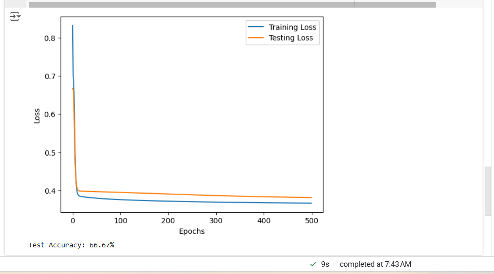

Here's a well-structured explanation for your Google Docs document on implementing a backpropagation learning algorithm for the IRIS dataset.

---

# Neural Network Implementation for IRIS Dataset Classification

### 1. **Importing Libraries and Loading Dataset**
We import essential libraries:
   - `numpy` for efficient numerical calculations.
   - `sklearn.datasets` to load the IRIS dataset, which includes 150 samples of three iris species with four features.
   - `train_test_split` to split the dataset into training and testing sets.
   - `OneHotEncoder` converts categorical labels to a one-hot encoded format for easy network processing.
   - `matplotlib.pyplot` to plot training and testing loss curves for analysis.

### 2. **Setting Seed and Preparing Data**
Setting `seed(1)` ensures consistent randomization, allowing reproducibility. After loading, the data is split into training and testing sets (`X_train`, `X_test`, `y_train`, `y_test`) and labels are one-hot encoded for each species class, representing each as a unique binary vector (e.g., `[1, 0, 0]` for the first class).

### 3. **Network Initialization**
The `initialize_network` function creates a neural network with one hidden layer:
   - Each neuron in the hidden layer has random weights for each input plus a bias, while output neurons also have random weights for each hidden neuron plus a bias. The structure provides flexibility to learn complex patterns from the dataset.

### 4. **Forward Propagation**
   - `activate` computes the weighted sum of inputs, and `transfer` applies the sigmoid activation function to produce a normalized output between 0 and 1.
   - `forward_propagate` processes inputs through each layer of the network, generating outputs for each neuron. This step results in predictions from the output layer.

### 5. **Backpropagation**
   - `transfer_derivative` calculates the gradient for the sigmoid function, essential for weight updates.
   - `backward_propagate_error` calculates the error term for each neuron. Output neurons calculate the difference from the expected values, while hidden neurons use a weighted error sum from the subsequent layer. This helps each layer adjust its outputs to reduce prediction errors.

### 6. **Weight Update with Regularization**
   - `update_weights` adjusts the weights based on calculated errors, with the learning rate (`l_rate`) controlling update magnitude. 
   - A regularization parameter (`reg_lambda`) penalizes larger weights, preventing overfitting by reducing each weight proportionally.

### 7. **Training the Network**
   - `train_network` performs forward and backward propagation for each epoch. During training, both training and testing losses are recorded to visualize the learning process over `n_epoch` iterations.

### 8. **Making Predictions and Calculating Accuracy**
   - `predict` determines the final classification by choosing the neuron with the highest output in the last layer. 
   - Model accuracy is calculated by comparing predictions with actual values in the test set, providing a metric for overall performance.

### 9. **Visualizing Training and Testing Curves**
   - `matplotlib` plots training and testing loss curves, allowing us to observe the convergence behavior and assess model generalization.

### 10. **Running and Evaluating the Model**
After training and testing, the model's accuracy on test data is displayed. The curves, combined with accuracy metrics, reveal how well the network has generalized to unseen data.

### Additional Notes
   - Adjust `n_hidden`, `l_rate`, `n_epoch`, and `reg_lambda` to further optimize performance.
   - High regularization (`reg_lambda`) can prevent overfitting but may reduce performance if set too high.

--- 

This structure covers the steps involved in implementing and optimizing the backpropagation algorithm for IRIS classification, with explanations of code functionality, parameters, and potential adjustments.
